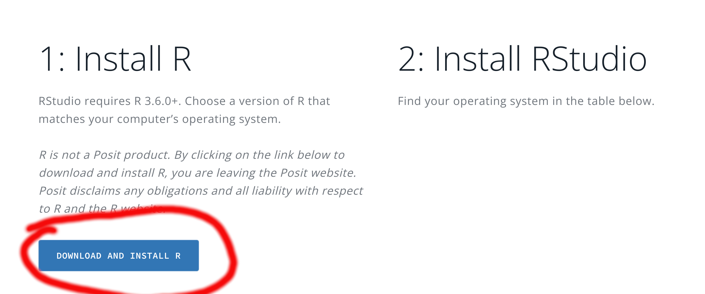
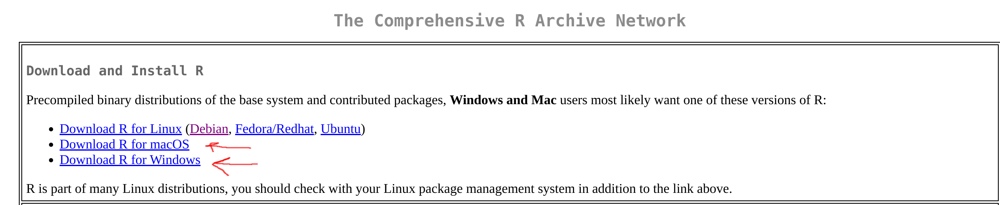
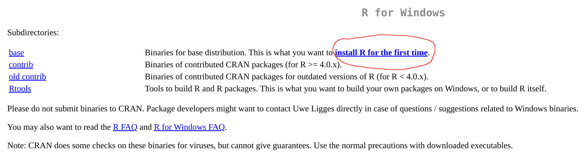
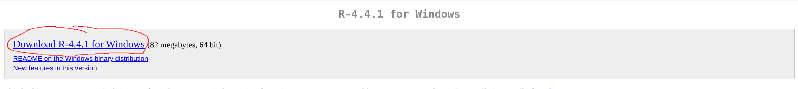
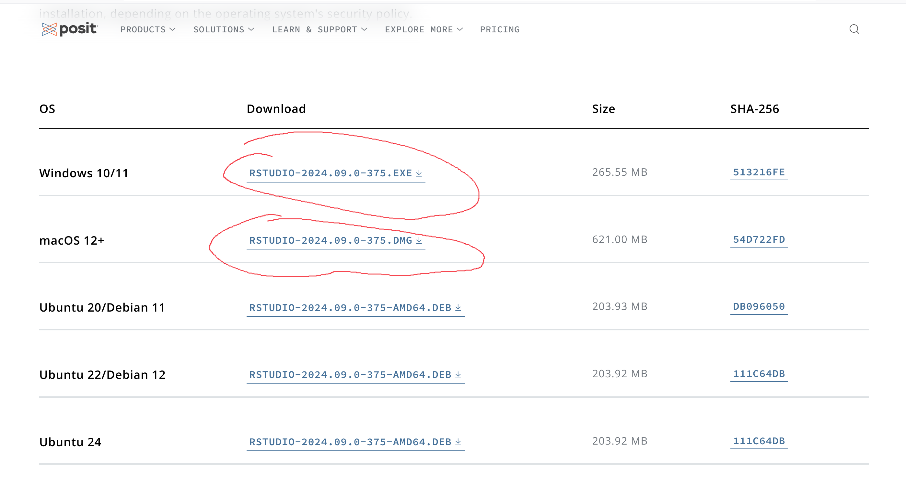
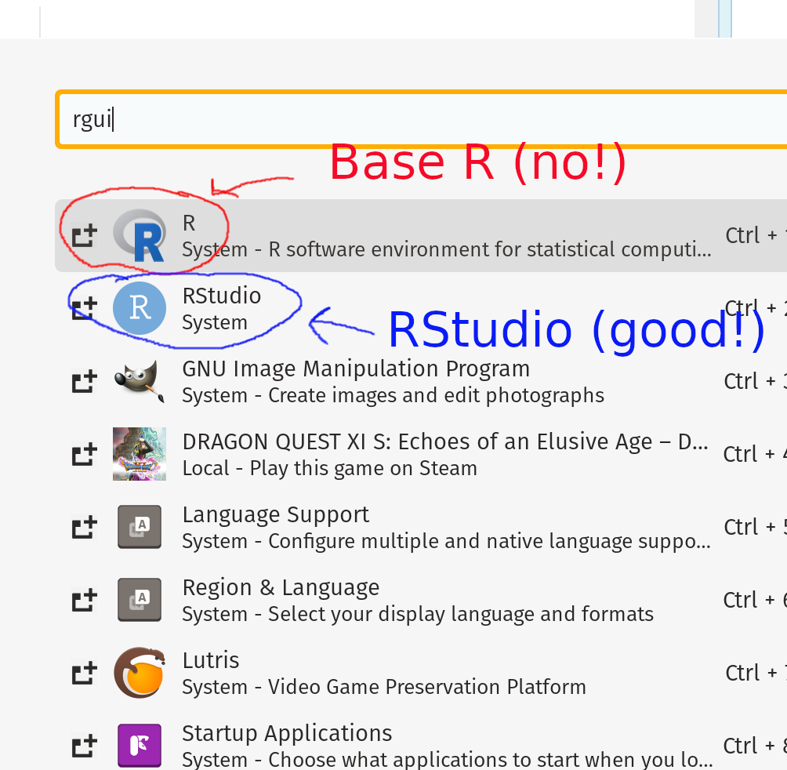
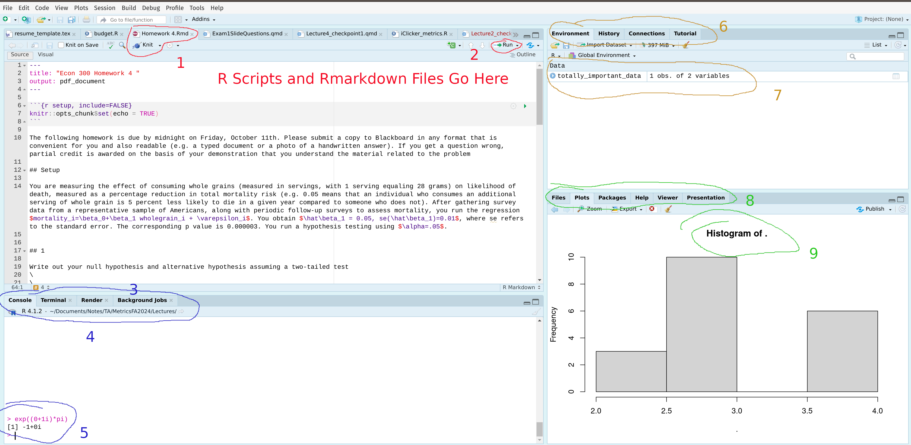

```{r setup, include=FALSE}
knitr::opts_chunk$set(echo = TRUE)
knitr::opts_chunk$set(warning = FALSE, message = FALSE) 
```

## Downloading R

https://posit.co/download/rstudio-desktop/

First download R. You'll want to follow the links based on your specific system. The following screenshots show how this works for Windows, though you'll follow similar instructions for a mac. If using a chromebook you'll need to see the specific instructions below. Once you have the installer downloaded, you should be able to click "next", "install", or "finish" with the default options without any issue.










then download and run Rstudio desktop. R can be used as a standalone with RGui (or via command line) but most people use Rstudio. 

## Installing Rstudio

For rstudio, use the same link as above and scroll down to directly obtain the executable or dpkg file for windows and mac OS, respectively. Similar to the base R installation, the default options will all be good. It will ask you to associate RStudio with an R installation at some point, so make sure you have installed R first. The default option should always be good to use, so you can just click "next" using all default options as before.




## Confirming the R installation

Just to clarify, R is the programming language, which comes with a command line interface (that is amazing for power users but otherwise no one uses) as well as an "RGui" application that allows you to run R code in a graphical interface. Virtually everyone uses Rstudio, which is an alternative to the base RGui with much more functionality. Rstudio is an example of an IDE, or integrated development environment. The base icons for the two programs looks similar, so make sure you're launching Rstudio:



## Using Rstudio

Rstudio is broken up into 4 quadrants by default (you may be missing the upper left quadrant if you haven't opened an R file yet). A basic overview of this is given below



1. \textcolor{red}{Files go in the upper left panel by default. If the file has unsaved changes it's name will be displayed in red. In general Rstudio's autosaving features are great, but you should still save frequently to avoid losing progress. If you have an rstudio file, a 'knit' option (circled) will be available, which will allow you to convert a markdown file into PDF or other portable, human-readable formats}
2. \textcolor{red}{You can run the entire contents of a script by pressing this button in the upper-right, or by using the "source" function. More commonly, you can run an individual line of code in a file by pressing control+enter (command+enter on a mac)}
3. \textcolor{blue}{Your console will be in the lower left by default, where you can run scratch code that you don't need to save. Note that there are several tabs here - you also have access to a terminal (for advanced users), a render tab for rmarkdown, nad a background jobs tab (also for advanced users). When you knit a document your focus will be automatically moved from console to 'render', so if you can't run code in console please make sure you are on the correct tab}
4. \textcolor{blue}{Directly below the console tab is your version of R and your working directory. When attempting to read in files, your base path will be this. ~ refers to your home directory, and is generally something like "C:/Users/username" but it can vary by system. You can change this with the "setwd" function}
5. \textcolor{blue}{This is the part of the console where you write code. Do not run important code here as it's easy to lose work this way. I normally use this to test out syntax if I'm unsure.}
6. \textcolor{orange}{This tab contains your environment by default, which lists out every variable you have stored. You can also get this by using the "ls" function.  The history tab is also available here, which includes every line of code you've run in console since starting the session (in case you need to retrieve something you previously wrote)}
7. \textcolor{orange}{Clicking on data frames will bring up an excel-style visualization of the data set (it calls the "view" function). Once you understand how to interact with data in R you will never use this feature, as it is far too slow.}
8. \textcolor{green}{Most commonly your plots will appear in this panel. The file explorer is also useful if you are unsure of where your working directory is. You can also bring up help documentation for any function by typing ?functionName in console (e.g. ?read.csv). Quality of documentation will vary by package, but is generally a good place to start if you don't know how to call a function}
9. \textcolor{green}{Your plots will go here - in the upper-left is an option to export the plot to an image file if you're unsure of how to do that via code (functions like 'png' and 'pdf' will do this). }

Also note that there are many ways to customize your R experience. Check out Tools > Global Options for a list. Some highlights include an ability to change to a dark theme, change autocompletion settings (RStudio has great autocomplete options), or changing keybindings (I use vim keybindings). You also have a hidden file named .Rprofile where you can customize launch settings for advanced users. 

## Basic Packages

One of the benefits of R is its robust package system, which allows users to upload their own packages of functions for other users to download. While base R has many features, many R packages are so commonly used that you should generally install them immediately upon downloading R. In general, to install a packages you use the "install.packages" function. Packages only ever need to be installed once:

```{r,eval=FALSE}
install.packages("dplyr") #common data manipulation
install.packages("ggplot2") #Make good looking graphs
install.packages("rmarkdown") #knit rmarkdown files
install.packages("magrittr") #pipe operator for old people before it was put into base R
install.packages("tinytex") #Probably already installed - used to easily install latex
```

Even if a package is installed, R will not know of these functions by default (it's namespace isn't attached). There are two ways to call a function in a package, the first is to use a scoping operator explicitly, e.g. ggplot2::ggplot(). More commonly, you run the library command, which only needs to be run once per session (but needs to be rerun every time R is opened)

```{r,eval=FALSE}
library(dplyr)
```

By default, messages in R are displayed in \textcolor{red}{red text}. Sometimes loading packages, such as dplyr, will display information in red text, but this does not necessarily indicate an error has occurred.

## Basic LaTeX Installation

Rmarkdown files can be used to 'knit' a file containing R code along with text into a nicely formatted document. I use this to create homework files and research papers, among other things. In order to render this output to a PDF, you will need a LaTeX installation. This is generally a painful process if you're unfamiliar with package management systems, but thankfully there is an easy way to install latex via R that will work on most systems:

```{r, eval=FALSE}
tinytex::install_tinytex()
```

You may need to type "Y" or sign in as admin for this to proceed, but this is the easiest way to get a minimal LaTeX installation on most systems.

## Setting up Rstudio Server for Chromebooks

If using a Chromebook you'll want to use the Linux (Debian) install using the built in terminal. The link has more information, but the following should be the barebones of what is needed. You'll run these commands within your linux terminal (penguin). The keys and file links change periodically as builds are updated, but these are up to date as of September 4th, 2024

```{bash, eval=FALSE}
sudo apt-get update
sudo apt-get install r-base r-base-dev
sudo apt-key adv --keyserver keyserver.ubuntu.com --recv-key '95C0FAF38DB3CCAD0C080A7BDC78B2DDEABC47B7'

```

This will install R as a command line program. You then need to install rstudio server (https://posit.co/download/rstudio-server/). You'll need to run

```{bash, eval=FALSE}
sudo apt-get install gdebi-core
wget https://download2.rstudio.org/server/focal/amd64/rstudio-server-2024.04.2-764-amd64.deb
sudo gdebi rstudio-server-2024.04.2-764-amd64.deb
```

Once you have these installed, you'll need to launch Rstudio server using the following command

```{bash,eval=FALSE}
/usr/sbin/rstudio-server start
```

then open 127.0.0.1:8787 in url bar in chrome (rstudio server uses port 8787 by default, but this can be changed using different arguments)

### Setting Up Rmarkdown for chrome

A tex package needs to be installed to render PDFs for rmarkdown - the following will work in a *nix environment with the firm run in terminal and the second run within R

```{bash, eval=FALSE}
sudo apt-get install texlive
```

```{r, eval=FALSE}
install.packages("tinytex")
tinytex::install_tinytex()
```

## Virtual Lab

If you're unable to install R, UIC has a virtual lab with a default R/RStudio installation that you can use. 

https://it.uic.edu/services/student/software-resources/remote-access-to-specialized-software-with-virtual-computer-labs/

